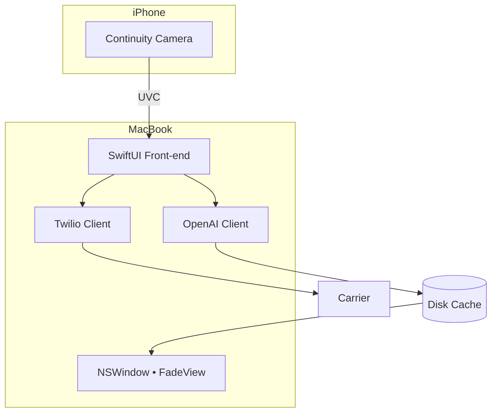

**DRAFT PRODUCT REQUIREMENTS DOCUMENT (PRD)**\
*Mac‑First AI Photo‑Booth • MacBook (Controller + Display) | iPhone Continuity Camera*

---

### 1 Purpose

Build a **single‑laptop** photo‑booth that needs **only a MacBook, an iPhone on a tripod, and an HDMI projector**.  The MacBook handles theme selection, countdown, capture (via Continuity Camera), AI transformation, SMS delivery, and an on‑projector “fade‑reveal” slideshow — no extra iPad, router, or Apple TV.

---

### 2 Success Criteria

| Goal                    | KPI                                                         |
| ----------------------- | ----------------------------------------------------------- |
| 🚀 Fast flow            | Guest completes session in < 15 s (median)                  |
| 🪄 Wow factor           | Fade reveal latency ≤ 2 s from shutter                      |
| 📲 Delivery reliability | 99 % themed photos sent via Twilio MMS (server logs)        |
| 💾 Cache efficiency     | 100 % slides read from disk on replay (no double downloads) |
| 💰 Cost ceiling         | Avg OpenAI cost ≤ \$0.05 / image; carrier MMS ≤ \$0.002     |

---

### 3 User Journey

1. **Operator** opens the Mac app → selects HDMI screen #2 as “Projector.”
2. **Guest** picks one of **9 theme buttons** and types their phone #.
3. Mac shows a **live preview** from the iPhone (Continuity Camera).
4. Countdown 3‑2‑1 (visual + beep) overlays on screen #1.
5. At 0, Mac captures a frame via `AVCapturePhotoOutput`.
6. **OpenAI Images** call returns themed JPEG.
7. **Twilio** texts themed JPEG to the guest.
8. **Projector** (screen #2) shows the original for 1 s, then **cross‑fades** to the themed image (1 s ease‑in‑out) and caches both.

---

### 4 Functional Requirements

| ID        | Requirement                                                                                   |
| --------- | --------------------------------------------------------------------------------------------- |
| **FR‑1**  | Detect connected iPhone via Continuity Camera (`deviceType == .continuityCamera`).            |
| **FR‑2**  | Live preview at ≥ 720p, 15 fps in an `NSViewRepresentable`.                                   |
| **FR‑3**  | Countdown overlay synced with shutter; audible beeps (`NSSound`).                             |
| **FR‑4**  | Capture JPEG via `AVCapturePhotoOutput`; fail gracefully if camera disconnects.               |
| **FR‑5**  | Call OpenAI Images (`b64_json`, 1536 × 1024); handle timeouts/retries.                        |
| **FR‑6**  | Send themed JPEG via Twilio MMS (`mediaUrl`) using backend signed URL.                        |
| **FR‑7**  | Create `/Caches/Slides/yyyyMMdd/uuid‑{orig,theme}.jpg`; reveal view loads from disk.          |
| **FR‑8**  | Second display full‑screen, borderless `NSWindow` at `.screenSaver` level; shows fade reveal. |
| **FR‑9**  | On app launch, clear cache older than 7 days or > 500 slides (LRU).                           |
| **FR‑10** | Phone numbers validated (E.164); never persisted beyond SMS send.                             |

---

### 5 Non‑Functional Requirements

- **OS Support**: macOS Ventura 13+ and iOS 16+ for Continuity Camera.
- **Performance**: AI + MMS round‑trip < 12 s on 5 G.
- **Cost Assumptions**: *gpt-image-1* at 1536 × 1024 ≈ **\$0.05 per image** (generation), plus carrier MMS fees ≤ \$0.002.
- **Security**: `.env` stores API keys; outbound traffic via HTTPS.
- **Accessibility**: Large buttons, VoiceOver labels, adjustable countdown volume.

---

### 6 System Architecture

---

### 7 Libraries / SDKs

| Area       | Choice                                        |
| ---------- | --------------------------------------------- |
| Camera API | AVFoundation (+ Continuity Camera)            |
| AI Client  | `openai` Swift SDK                            |
| SMS Client | `TwilioSwift` or server‑side function         |
| Cache      | Apple FileManager + Nuke DataCache (optional) |
| UI         | SwiftUI, Combine                              |

---

### 8 5‑Day MVP Roadmap

| Day        | Targets                                                                 | Key AI Prompt Blocks                                                         |
| ---------- | ----------------------------------------------------------------------- | ---------------------------------------------------------------------------- |
| 0 (Prep)   | Xcode project, entitlements, API keys (.env), two‑screen detection stub | “SwiftUI macOS app template with dual‑screen window.”                        |
| 1          | **Continuity Camera live preview** with capture button                  | “AVCaptureSession picking ContinuityCamera device in Swift.”                 |
| 2          | **Theme UI + countdown overlay**                                        | “SwiftUI grid of 9 buttons updating @State themeId; countdown overlay view.” |
| 3          | **OpenAI call + Twilio MMS**                                            | “Async function calling OpenAI Images and Twilio, return themed UIImage.”    |
| 4          | **Fade‑reveal window on HDMI screen** + disk caching                    | “SwiftUI view that fades one NSImage into another.”                          |
| 5 (buffer) | Error handling, cache prune, full demo video                            | N/A                                                                          |

*Stretch goals (post‑MVP)*: retry queue, customizable fade duration, multi‑theme rotation.

---

### 9 Risks & Mitigations

| Risk                          | Mitigation                                                             |
| ----------------------------- | ---------------------------------------------------------------------- |
| Continuity camera disconnects | Monitor `AVCaptureDeviceWasDisconnected` notification; auto‑reconnect. |
| SMS carrier block             | Compress image ≤ 600 KB; fallback to regular SMS w/ img URL.           |
| Slow AI latency               | Pre‑warm OpenAI endpoint; increase prompt tokens only if needed.       |
| Dual‑screen mis‑detect        | Allow manual screen selection in Settings sheet.                       |

---

### 10 Out‑of‑Scope (v1)

- Multi‑camera, multi‑Mac chaining.
- Web gallery or cloud slideshow.
- User‑defined prompts.
- Theme scheduling or randomization.

---

*Last revised • 2025‑07‑06 • MacBook + Continuity‑Camera edition*

